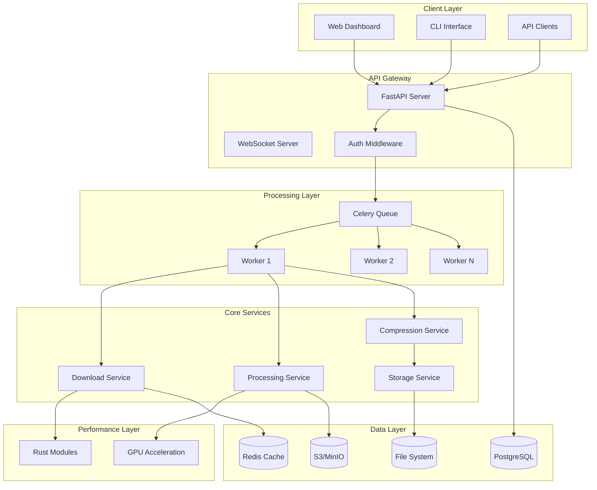

# Design Document

## Overview

The Enterprise Video Processing Platform is designed as a microservices-based system with clear separation of concerns, leveraging both Python for orchestration and Rust for performance-critical operations. The architecture follows enterprise patterns with comprehensive monitoring, security, and scalability features.

## Architecture

### High-Level Architecture



### Component Architecture

The system is organized into distinct layers:

1. **Presentation Layer**: Web UI, CLI, and API clients
2. **API Layer**: FastAPI with authentication and WebSocket support
3. **Business Logic Layer**: Core services for download, processing, and compression
4. **Performance Layer**: Rust modules for CPU-intensive operations
5. **Data Layer**: Multiple storage backends and caching

## Components and Interfaces

### Core Services

#### Download Service
- **Purpose**: Orchestrates video downloading with multiple strategies
- **Key Features**:
  - yt-dlp integration for platform-specific downloads
  - Direct HTTP downloads with chunking and resume support
  - Concurrent download management with semaphore-based throttling
  - Metadata extraction and caching
- **Interface**: Async methods for batch downloading with progress callbacks
- **Dependencies**: CacheService, StorageService, JobRepository

#### Processing Service
- **Purpose**: Main orchestration service for video processing workflows
- **Key Features**:
  - Hardware acceleration detection and configuration
  - Parallel video processing with segment-based approach
  - Quality analysis and optimization
  - Job lifecycle management
- **Interface**: RESTful API endpoints and async processing methods
- **Dependencies**: DownloadManager, VideoProcessor, Compressor, Merger

#### Hardware Acceleration Manager
- **Purpose**: Detects and configures GPU acceleration
- **Key Features**:
  - Multi-vendor GPU support (NVIDIA, AMD, Intel, Apple)
  - Automatic fallback to CPU processing
  - Optimal encoding parameter selection
  - Performance monitoring and adjustment
- **Interface**: Hardware detection and FFmpeg parameter generation
- **Dependencies**: System hardware detection utilities

#### Storage Service
- **Purpose**: Manages file storage across multiple backends
- **Key Features**:
  - Multi-backend support (local, S3, MinIO)
  - Temporary file lifecycle management
  - Secure file access with expiring URLs
  - Automatic cleanup and retention policies
- **Interface**: Unified storage API with backend abstraction
- **Dependencies**: Cloud storage SDKs, filesystem utilities

### API Layer

#### FastAPI Application
- **Endpoints**:
  - `POST /api/v1/jobs` - Create processing job
  - `GET /api/v1/jobs/{job_id}/status` - Get job status
  - `POST /api/v1/jobs/{job_id}/cancel` - Cancel job
  - `GET /api/health` - Health check
  - `GET /api/metrics` - Prometheus metrics
- **Middleware**: Authentication, rate limiting, CORS, logging
- **WebSocket**: Real-time progress updates and notifications

#### Authentication & Authorization
- **Strategy**: JWT tokens with role-based access control
- **Features**: User management, API key support, audit logging
- **Integration**: Middleware-based request validation

### Performance Layer

#### Rust Modules
- **Parallel Downloader**: High-performance chunk-based downloading
- **Video Processor**: Hardware-accelerated video operations
- **File I/O**: Memory-mapped file operations for large files
- **Python Bindings**: PyO3-based integration with Python services

#### GPU Acceleration
- **NVIDIA**: CUDA/NVENC integration
- **AMD**: VAAPI support
- **Intel**: QuickSync integration
- **Apple**: VideoToolbox support

## Data Models

### Job Model
```python
class Job:
    id: str
    user_id: str
    status: JobStatus  # pending, downloading, processing, completed, failed, cancelled
    request_data: dict
    created_at: datetime
    updated_at: datetime
    completed_at: Optional[datetime]
    output_file: Optional[str]
    errors: List[str]
    progress: dict
    task_id: Optional[str]
```

### Video Metadata Model
```python
class VideoMetadata:
    url: str
    episode_number: int
    title: Optional[str]
    duration: Optional[float]
    filesize: Optional[int]
    format: Optional[str]
    resolution: Optional[str]
    downloaded_path: Optional[Path]
    processed_path: Optional[Path]
```

### Processing Configuration Model
```python
class ProcessingConfig:
    quality: VideoQuality  # 480p, 720p, 1080p, 2160p
    compression_preset: CompressionPreset
    compression_level: int
    use_gpu: bool
    use_hardware_accel: bool
    priority: int
    notification_webhook: Optional[str]
    tags: List[str]
```

## Error Handling

### Error Categories
1. **Network Errors**: Connection timeouts, DNS failures, HTTP errors
2. **Processing Errors**: FFmpeg failures, codec issues, hardware errors
3. **Storage Errors**: Disk space, permission issues, cloud storage failures
4. **Validation Errors**: Invalid URLs, unsupported formats, configuration errors

### Error Handling Strategy
- **Retry Logic**: Exponential backoff for transient failures
- **Circuit Breaker**: Prevent cascade failures in external services
- **Graceful Degradation**: Fallback to alternative processing methods
- **Error Reporting**: Comprehensive logging with structured error data

### Recovery Mechanisms
- **Job Resumption**: Resume interrupted jobs from checkpoints
- **Partial Recovery**: Process successfully downloaded episodes even if some fail
- **Cleanup**: Automatic cleanup of failed job artifacts

## Testing Strategy

### Unit Testing
- **Coverage**: All core services and utilities
- **Mocking**: External dependencies (Redis, PostgreSQL, cloud storage)
- **Test Data**: Synthetic video metadata and mock responses
- **Tools**: pytest, pytest-asyncio, pytest-mock

### Integration Testing
- **API Testing**: Full request/response cycle testing
- **Database Testing**: Repository pattern testing with test database
- **Storage Testing**: Multi-backend storage operations
- **Queue Testing**: Celery task execution and result handling

### Performance Testing
- **Load Testing**: Concurrent job processing under load
- **Benchmark Testing**: Rust module performance validation
- **Memory Testing**: Memory usage patterns and leak detection
- **GPU Testing**: Hardware acceleration performance validation

### End-to-End Testing
- **Full Workflow**: Complete video processing pipeline
- **Error Scenarios**: Failure handling and recovery testing
- **Multi-User**: Concurrent user scenarios
- **Deployment Testing**: Container and Kubernetes deployment validation

## Security Considerations

### Authentication & Authorization
- **JWT Tokens**: Secure token-based authentication
- **Role-Based Access**: User roles and permissions
- **API Rate Limiting**: Prevent abuse and DoS attacks
- **Audit Logging**: Comprehensive access and operation logging

### Data Security
- **Encryption**: Encrypt sensitive data at rest and in transit
- **Temporary File Security**: Secure handling of temporary video files
- **Network Security**: TLS/SSL for all external communications
- **Input Validation**: Comprehensive validation of all user inputs

### Infrastructure Security
- **Container Security**: Minimal base images and security scanning
- **Network Policies**: Kubernetes network policies for service isolation
- **Secrets Management**: Secure handling of API keys and credentials
- **Monitoring**: Security event monitoring and alerting

## Deployment Architecture

### Container Strategy
- **Multi-Stage Builds**: Optimized Docker images
- **Base Images**: Minimal security-hardened base images
- **Layer Optimization**: Efficient layer caching and size optimization

### Kubernetes Deployment
- **Microservices**: Separate deployments for API, workers, and services
- **Horizontal Scaling**: Auto-scaling based on queue depth and CPU usage
- **Resource Management**: CPU and memory limits and requests
- **Health Checks**: Liveness and readiness probes

### Storage Strategy
- **Persistent Volumes**: Shared storage for temporary and output files
- **Storage Classes**: Different storage tiers for different use cases
- **Backup Strategy**: Regular backups of persistent data

### Monitoring & Observability
- **Metrics**: Prometheus metrics for all components
- **Logging**: Centralized logging with ELK stack
- **Tracing**: Distributed tracing for request flow analysis
- **Alerting**: Comprehensive alerting for system health and performance

## Performance Optimizations

### Concurrency & Parallelism
- **Async I/O**: Non-blocking I/O operations throughout the system
- **Thread Pools**: Dedicated thread pools for CPU-intensive operations
- **Process Pools**: Multi-process execution for parallel video processing
- **Queue Management**: Intelligent job scheduling and resource allocation

### Memory Management
- **Memory Mapping**: Memory-mapped files for large video processing
- **Streaming**: Stream-based processing to minimize memory usage
- **Garbage Collection**: Proactive cleanup of temporary resources
- **Buffer Management**: Optimized buffer sizes for different operations

### Caching Strategy
- **Redis Caching**: Metadata and configuration caching
- **Local Caching**: In-memory caching for frequently accessed data
- **CDN Integration**: Content delivery network for output files
- **Cache Invalidation**: Intelligent cache invalidation strategies

### Hardware Optimization
- **GPU Utilization**: Optimal GPU resource allocation and scheduling
- **CPU Affinity**: CPU core affinity for performance-critical operations
- **I/O Optimization**: SSD optimization and parallel I/O operations
- **Network Optimization**: Connection pooling and keep-alive strategies